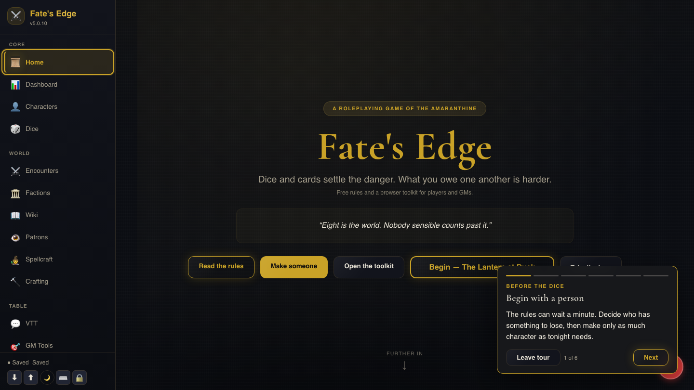

[](https://github.com/Chronophage-net/fates-edge-apps/actions/workflows/build-apps-and-packages.yml)

# Fate's Edge Toolkit

> A modular, self-contained toolkit for running *Fate's Edge* TTRPG campaigns — real-time collaboration, VTT integrations, Game Master tooling, and a full in-browser magic/monastic-path system.

[](LICENSE.code)
[](LICENSE.srd)
[](LICENSE.proprietary)
[](https://nodejs.org/)
[](https://foundryvtt.com/)
[](https://discord.com/)

---

## Overview

*Fate's Edge* is a narrative-first tabletop roleplaying game built around Story Beats, Patrons, Rites, and consequence-driven fiction. This repository is the digital toolkit that grew up around it: a browser-based application for playing and running the game, a real-time server for sharing that state live across a table, and a set of integrations that bring the same campaign into Foundry VTT, Roll20, and Discord rather than asking anyone to leave the tools they already use.

It's a monorepo — one Git repository holding several related projects side by side, each independently runnable, all talking to the same campaign server and the same underlying game data. A companion project, the AI GM Bot, lives in its own sibling repository and plugs into this ecosystem the same way a human co-GM would: as another client on the socket server.

## What's inside

| Component | What it is | Where |
|---|---|---|
| **Web client** | The main application — character sheets, dice, the VTT, encounters, the magic system, Kon'reh, Toll & Veil, and everything else players and GMs touch day to day. Runs entirely in the browser. | [`utilities/javascript/fates-edge-web-client/`](utilities/javascript/fates-edge-web-client/) |
| **Socket server** | The real-time backend — WebSocket sync, GM election, the Deck of Consequences, the Adventure Engine, account auth, campaign persistence. A sibling directory in this same repo, not a separate project. | [`utilities/javascript/fates-edge-socket-server/`](utilities/javascript/fates-edge-socket-server/) |
| **Terminal client** | A MUD-style CLI against the same server, mainly for testing and administration. | `utilities/javascript/fates-edge-terminal/` |
| **Desktop client** | An Electron wrapper around the web client, for a native app instead of a browser tab. | [`utilities/javascript/fates-edge-desktop-client/`](utilities/javascript/fates-edge-desktop-client/) |
| **Python CLI client** | A scriptable command-line/REPL client covering the full REST and WebSocket surface. | [`utilities/python/fates-edge-python-client/`](utilities/python/fates-edge-python-client/) |
| **Python desktop tool** | A standalone Tkinter character sheet + GM screen, offline-first with optional server sync. | [`utilities/python/fates_edge_tool/`](utilities/python/fates_edge_tool/) |
| **Foundry VTT bridge** | A Foundry module that mirrors chat, rolls, characters, scenes, and GM roles between Foundry and the campaign server. | [`utilities/vtt_mods_bots/foundry_fates-edge-bridge/`](utilities/vtt_mods_bots/foundry_fates-edge-bridge/) |
| **Discord bot** | Slash commands for the same campaign surface, plus GM election and admin tools, from inside Discord. | [`utilities/vtt_mods_bots/fates-edge-discord-bot/`](utilities/vtt_mods_bots/fates-edge-discord-bot/) |
| **Roll20 API script** | The same integration surface as a Roll20 API script. | [`utilities/vtt_mods_bots/fates-edge-roll20/`](utilities/vtt_mods_bots/fates-edge-roll20/) |
| **Avrae module** | `!fe` commands for tables already living in Avrae-based Discord servers. | `utilities/vtt_mods_bots/avrae_module.txt` |

Two more pieces round out the ecosystem without living in this repo:

- **[`fates-edge-ai-gm-bot`](https://github.com/Chronophage-net/fates-edge-ai-gm-bot)** — an AI Game Master that connects to the socket server as an ordinary client (optionally holding the `assistant-gm` role) and narrates using a pluggable AI backend (OpenAI, DeepSeek, or a local Ollama model). It used to live inside this monorepo; it's now developed separately and cloned as a sibling directory when you want it. See its own README for setup, and the AI GM Voice/Reactive Soundscape section below for how it layers onto this toolkit.
- The Fate's Edge SRD, Essentials guide, and GM Screen — the rules content the web client's Document Viewer renders, bundled under `utilities/javascript/fates-edge-web-client/data/docs/`.

## Architecture

The campaign server is authoritative for shared state; every other piece is a client of it.

```
                         Fate's Edge rules & campaign data
                                       │
                                       ▼
                          ┌───────────────────────┐
                          │     Socket Server      │
                          │  authoritative game    │
                          │  state, one per table   │
                          └───────────┬────────────┘
                                      │  WebSocket / REST
              ┌───────────────────────┼───────────────────────┐
              │                       │                       │
              ▼                       ▼                       ▼
        Web / Desktop /          AI GM Bot              Foundry / Roll20 /
        Terminal / Python          (sibling repo,             Discord / Avrae
        clients                    optional)
```

Because the server owns the shared truth and every interface is just a client of it, a new interface (another VTT, another bot, another platform) is additive — it doesn't require touching how existing clients work. This is also why the AI GM Bot integrates cleanly from a separate repository: it's just another socket connection, distinguishable from a human GM only by the optional `assistant-gm` room role, which grants narrative authority without any elevated server permission of its own.

## Quick start

### See it running, no setup

```bash
npm run demo
```

[](docs/media/demo.mp4)

*Click to play `docs/media/demo.mp4` — the AI GM bot joining room `DEMO` and narrating a live reply, generated entirely by a local Ollama instance. No API keys, nothing cloud-hosted.*

This brings up the web client, the real-time server, Redis, a local Ollama instance, and the AI GM bot (cloned automatically as a sibling directory if it isn't already there), wired together with working defaults. Open `http://localhost:8080`, create or join room `DEMO`, and the AI GM bot takes the GM seat within about ten seconds. The first run also builds three Docker images and pulls a small local model (~1.3GB) — a few minutes, not literally two. Every run after that reuses the cache. See `docker-compose.full.yml`'s header comment and `.env.demo.example` for the full set of knobs (including a `DEMO_LEVEL=light`/`quality` preset), and `npm run demo -- --down` to tear it down.

Add `-- --voice` or `-- --voice-rvc` to hear the GM speak in a cloned voice via a local Chatterbox TTS container — see [`fates-edge-ai-gm-bot/docs/local-voice-cloning/VOICE-CLONING-LOCAL-SETUP.md`](https://github.com/Chronophage-net/fates-edge-ai-gm-bot/blob/main/docs/local-voice-cloning/VOICE-CLONING-LOCAL-SETUP.md) for what that's actually doing.

### Run it for real

**Prerequisites:** Node.js 24.x+, npm, a modern browser.

**Web client** (runs entirely in the browser — all data lives in `localStorage` until you connect it to a server):

```bash
cd utilities/javascript/fates-edge-web-client
npm install
npm run dev      # local dev server via Vite
# or
./build.sh       # produces dist/ for static hosting
```

**Real-time / campaign server** (needed for shared play — chat, sync, the Adventure Engine, GM election):

```bash
cd utilities/javascript/fates-edge-socket-server
npm install
cp env-example.md .env   # edit with your settings
node server-start.js     # listens on :3000 by default (:10000 via Docker — see its own README)
```

See [the socket server's own README](utilities/javascript/fates-edge-socket-server/README.md) for what it does and its full setup guide.

### Docker (the whole ecosystem, one command)

```bash
cp .env.example .env
docker-compose up                        # web client (:8080) + server (:10000)
docker-compose --profile turn up         # + coturn TURN relay, for voice chat behind strict NATs
docker-compose --profile bots up         # + AI GM bot + Discord bot
docker-compose --profile discord-bot up  # + just the Discord bot
```

The `bots` and `ai-gm-bot` profiles need `fates-edge-ai-gm-bot` cloned as a sibling directory to `fates-edge-apps`; every other profile works without it. Each component also has its own standalone `Dockerfile`/`docker-compose.yml` if you'd rather run just one piece — see `docker-compose.yml`'s header comments and `.env.example` for the full option list.

### VTT integrations & other clients

Each has its own README with full setup steps:

- [Foundry VTT bridge](utilities/vtt_mods_bots/foundry_fates-edge-bridge/README.md) — copy the module folder into `Data/modules/`, enable it.
- [Discord bot](utilities/vtt_mods_bots/fates-edge-discord-bot/README.md) — `npm install && npm start`, or `docker-compose --profile discord-bot up`.
- [Roll20 API script](utilities/vtt_mods_bots/fates-edge-roll20/README.md) — paste into a Roll20 API script.
- Avrae — paste `utilities/vtt_mods_bots/avrae_module.txt` into Discord to create the `!fe` alias.
- [Terminal client](utilities/javascript/fates-edge-terminal/) — `node terminal-client.js`.
- [Python CLI](utilities/python/fates-edge-python-client/README.md) — `pip install . && fates-edge-cli --help`.

## What it does

**Playing:** character creation and management with a builder wizard and talent editor, Fate's Edge dice resolution, encounter and combat tracking with objective-type clocks (Combat, Skill Challenge, Trap/Ward, Lockpick, Heist, Social, and freeform Custom), a Wiki and Document Viewer for the SRD/Essentials/GM Screen, and full-text search across all of it.

**The magic system (Spellcraft):** a unified UI covering every path in the game — the TAGS calculator for Free Casters, patron Rites for Runekeepers and Invokers, Cantor songs and Push It mechanics, Witchcraft's hedge gifts and rituals, Summoning's bestiary and spirit binding, talent-gated Monastic traditions, and a custom Spellbook for signature combinations.

**Running a campaign:** faction and patron management, a campaign Kanban board, a shared Whiteboard, GM Tools separated from the shared player view, and a Travel Planner for overland routes.

**Playing together:** real-time sync of chat, dice, characters, timers, and scenes over WebSocket; the shared Deck of Consequences and Crown Spread; GM/Co-GM/Assistant-GM/Player/Spectator roles with election and promotion; WebRTC voice chat with TURN support for restrictive networks; and session recording (screen + mic, bundled with an auto-generated, event-driven `.srt`) — see [Transcription](#transcription) below for pairing that with a real speech-to-text tool.

**Two original games**, built on the same real-time infrastructure and playable pass-and-play, solo against AI, or as a live multiplayer table: **Kon'reh**, a strategy board game with six AI opponent "Schools" and a coaching mode, and **Toll & Veil**, a card game with optional Points/XP/String stakes.

**An optional AI Game Master**, via the sibling [`fates-edge-ai-gm-bot`](https://github.com/Chronophage-net/fates-edge-ai-gm-bot) repo, connecting through this repo's socket server exactly like any other client — see that repo's README for what it does, and below for how its voice features reach every surface.

### AI GM voice, TTS & reactive soundscape

Three independent, off-by-default features layered on the AI GM Bot and relayed through this repo's socket server, the same way chat and dice already are:

- **Voice narration (TTS)** — the AI GM's replies are synthesized to speech and broadcast alongside the text. Played back in the web client (opt-in toggle), the Foundry bridge (opt-in setting), and the Discord bot (opt-in voice channel); acknowledged but not played by Roll20/terminal/Python clients, which have no audio output.
- **Voice cloning (RVC)** — an optional second layer on top of TTS that re-voices the narration through a trained [RVC](https://github.com/RVC-Project/Retrieval-based-Voice-Conversion-WebUI) model, so the GM consistently sounds like one specific voice.
- **Reactive soundscape** — the AI GM can shift the room's background ambience to match the scene, automatically on scene changes or explicitly mid-scene. The web client crossfades to the matching track client-side; Discord posts a text-only "Now Playing" note.

See the AI GM Bot's own README and `DESIGN.md` for setup and the full pipeline.

### Accessibility

Accessibility is an ongoing, actively maintained part of the web client — focus management, screen-reader announcements, a high-contrast theme, two independent opt-in text-to-speech features, and labeled controls throughout, with matching coverage in the Foundry bridge and Discord bot. See [`ACCESSIBILITY.md`](utilities/javascript/fates-edge-web-client/ACCESSIBILITY.md) for the full rundown of what's implemented, where to find it, and how to use it.

### Transcription

Session Recording's `.srt` is **event-driven, not audio transcription** — built from in-app actions (deck draws, timer ticks, scene changes) plus, if you opt in, best-effort browser speech recognition (`SpeechRecognition`, Chrome/Edge) folded in as `[SPEECH]` lines. It's good for search and skimming a recording, not a substitute for a real spoken-word transcript — that's deliberately out of scope for what is fundamentally a VTT. For an actual transcript, run the `.webm` from your session recording through [whisper.cpp](https://github.com/ggerganov/whisper.cpp) or [faster-whisper](https://github.com/SYSTRAN/faster-whisper) (both run fully offline) or a cloud speech-to-text API of your choice; most of these tools accept `.webm`/`.wav` directly and can emit their own `.srt` to merge alongside the event log.

## Scaling & security

The socket server runs as a single, dependency-free instance by default, and can scale two independent ways: `CLUSTER_WORKERS` uses more of one machine's CPU cores via Node's `cluster` module, and `REDIS_URL` runs multiple instances behind a load balancer. The two combine. See [`SCALING.md`](utilities/javascript/fates-edge-socket-server/SCALING.md).

Multiplayer surfaces get the same security treatment as everything else: per-IP and per-connection rate limiting, per-room client caps, server-verified socket identities (a client can't spoof another player's `socketId`), sanitized network-supplied display names and rich text, and authoritative validation of anything with a stake attached (XP wagers, String debt). Found a security issue? See [`SECURITY.md`](SECURITY.md) for how to report it privately.

## Documentation map

| Document | Covers |
|---|---|
| [`API.md`](API.md) | The full REST and WebSocket event reference. |
| [`COMMUNITY_USE_POLICY.md`](COMMUNITY_USE_POLICY.md) | Plain-language FAQ over what the licenses below actually let you do. |
| [`CHANGELOG.md`](CHANGELOG.md) | Release-by-release history — the place version-specific "what changed" belongs. |
| [`VERSIONING.md`](VERSIONING.md) | How versions are cut across the ecosystem's repos. |
| Each component's own `README.md` / `DESIGN.md` | What that piece does and how it's built — start there for anything component-specific. |

## License

**New here?** [`COMMUNITY_USE_POLICY.md`](COMMUNITY_USE_POLICY.md) is a plain-language FAQ over the licenses below — start there if you're wondering what you can do with this repo.

| Component | License | Commercial use |
|---|---|---|
| Source code | [MIT](LICENSE.code) | Yes |
| SRD & Essentials guide | [CC BY-NC-SA 4.0](LICENSE.srd) | No |
| Setting lore, characters, factions, proprietary magic systems, art, Kon'reh, Toll & Veil | [All Rights Reserved](LICENSE.proprietary), © Nicholas A. Gasper, distributed for free | No — contact support@fates-edge.com |

When in doubt, check the license file associated with the specific content you're using.

## Contributing

1. Fork the repository and branch from `main`.
2. Follow the existing code style — ES modules, `const`/`let`, async/await, JSDoc on functions.
3. Add tests for new functionality where the component has a test suite.
4. Update the relevant README/DESIGN doc if behavior changes, and add a `CHANGELOG.md` entry — not a new paragraph in this README.
5. Open a pull request with a clear description.

## Credits

**Creator & Author:** Nicholas A. Gasper — [support@fates-edge.com](mailto:support@fates-edge.com) — [fates-edge.com](https://fates-edge.com) — [GitHub Issues](https://github.com/Chronophage-net/fates-edge-apps/issues)

---

> *"The coin that never spends is the one you don't remember taking."*
> — Serafine of the Velvet Touch

<p align="center">
  <sub>Made with ❤️ by Nick Gasper</sub>
</p>
