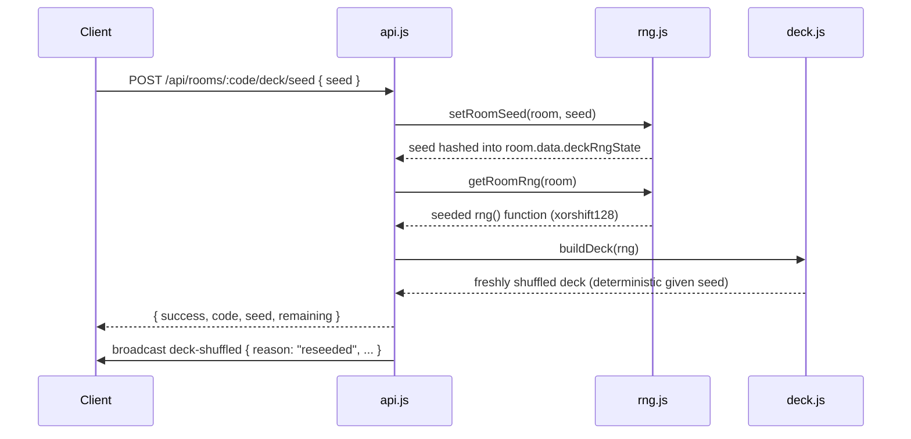
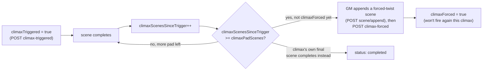

# Fate's Edge Socket Server — Design

> Companion documents: [`README.md`](README.md) (what this server does, plain-language), [`ROLES.md`](ROLES.md) (the role/permission model), [`SCALING.md`](SCALING.md) (multi-instance deployment), [`ROADMAP.md`](ROADMAP.md) (planned work), [`INSTALL.md`](INSTALL.md) (setup/ops).

## Overview

The socket server is a Node.js/Express HTTP API plus **two** parallel WebSocket transports — Socket.IO and a plain `ws` server, both mounted on the same HTTP port — that broadcast room state, chat, dice rolls, deck draws, and adventure progress to everyone connected to a room. It listens on **10000** by default (`PORT`, `HOST` defaults to `0.0.0.0`).

## Technology stack

| Layer | Technology |
|---|---|
| HTTP framework | Express.js |
| Real-time transport | Socket.IO **and** a plain `ws` server, both active simultaneously |
| Password hashing | bcryptjs |
| Sessions | JWT (`jsonwebtoken`) — the token itself is the session, no server-side session store |
| Persistence | SQLite by default (`server/storage.js`, `campaigns.db`); optional PostgreSQL (`pg`) or MySQL (`mysql2`) via `DATABASE_TYPE`/`DATABASE_URL` |
| Ephemeral room state | An in-memory `Map` (`server/room.js`), scoped to one process, gone on restart |
| Horizontal scaling | Optional Redis pub/sub relay, off by default — see [`SCALING.md`](SCALING.md) |
| Config | `dotenv` + environment variables, with an optional `server/config.json` overlay |

There's no caching layer, no PDF conversion, no outbound email, no job scheduler, and no Helmet.js/CSP/HSTS configuration — the server's job is narrow (relay room state, persist campaigns) and the dependency list stays narrow to match. `server/api.js` is the authoritative route list at any given moment; grep it for `router.get/post/put/delete` rather than trusting a hand-copied table anywhere, this document included.

### Why two WebSocket transports

`server/socketio-handlers.js` and `server/ws-handlers.js` implement the same room protocol independently, one over Socket.IO and one over plain `ws`, both listening on the same HTTP server (`server/index.js`). This exists so the client can use whichever transport is more reliable in a given deployment — Socket.IO's fallback/reconnection logic versus a plain WebSocket with less overhead — and both are first-class rather than one being a legacy path kept around for compatibility. `room.js`'s `broadcastToRoom()` is the single function that delivers a message to both: Socket.IO clients via `io.to(roomCode).emit(...)`, plain-`ws` clients via a direct loop over that room's tracked connections, and — if Redis scaling is enabled — relayed to other server instances too (see [`SCALING.md`](SCALING.md)).

## HTTP API

Routes group into a handful of feature areas: rooms (create/list/inspect, client lists, kick/ban/unban), characters (per-room CRUD plus an account-owned character *library* independent of any room, and a claim/release bridge tying a library character to a room's live roster — see [`ROLES.md`](ROLES.md)), the deck (draw/shuffle/history, Crown Spread, and the seed endpoints below), the Adventure Engine (load/reset an adventure, advance scenes/timers, log entries, run encounters, pace or force a climax), the whiteboard, campaigns (manual short-code share plus a separate always-latest auto-save — see `server/storage.js`'s header comment for why those two don't share one retention table), auth, modules, TURN credentials, and health checks.

### The deck's PRNG

The Deck of Consequences shuffles with a per-room xorshift128 PRNG (`server/rng.js`) rather than bare `Math.random()`. Each room's state carries a seed, and `deck.js`'s `buildDeck()`/`shuffleArray()` both take an optional `rng` function that defaults to `Math.random` when omitted — so any call site that doesn't care about seeding behaves exactly as it always has. `GET /api/rooms/:code/deck/seed` returns the room's current seed; `POST` (`{ seed }`) reseeds and reshuffles, broadcasting `deck-shuffled` with `reason: "reseeded"`. The practical effect is that a room's entire shuffle sequence is reproducible from its seed — useful for reproducing a specific draw sequence in a bug report, or giving a streamed session a fair, pre-committed shuffle everyone can verify after the fact — without the server needing to store the full deck order separately.



### Adventure climax pacing

A triggered climax act can otherwise stall — players circling a scene without resolving it — so adventure state tracks three fields: `climaxPadScenes` (how many scenes of "pad" a triggered climax gets, default `2`, settable per-adventure via `load-custom`), `climaxScenesSinceTrigger` (increments once per completed scene while `climaxTriggered` is true), and `climaxForced` (flips true once a forced twist has fired, resets on the next adventure load). Once the pad runs out, `POST /api/rooms/:code/adventure/climax-forced` becomes the server-side hook a GM — human or the AI GM Bot's `adventure-director.js` — calls to push the climax toward resolution, broadcasting `adventure-climax-forced`. This route only *records* that a forced twist happened; the twist's actual content is generated GM-side and appended via the ordinary `scene/append` route first. The server never generates narrative content itself.



## WebSocket protocol

Both transports speak the same logical protocol; `server/socketio-handlers.js`'s `socket.on(...)` calls and `server/ws-handlers.js`'s `switch` cases are the authoritative event list. Client-originated events cover joining/leaving a room, GM request/approve and role changes, character select/claim/release, deck draws/shuffle/history, chat and dice rolls, voice signaling (offer/answer/ICE/status), adventure state changes, module push/list/cleanup, whiteboard updates, kick/ban, and a generic `event` passthrough — used by client-side features like Kon'reh and Toll & Veil to ride the same relay without needing bespoke server code per feature.

### Room state

```javascript
{
  name: String,              // "Room {CODE}"
  code: String,               // uppercased room code
  clients: Map,                // clientId -> { ws|socket, role, name, userId?, ... }
  deck: Array,                 // built via deck.js's buildDeck()
  deckHistory: Array,
  deckOffset: Number,
  // + a per-room deck PRNG seed (server/rng.js) — see "The deck's PRNG" above
  characters: Object,          // normalizeCharKey(name) -> character record
  characterClaims: Object,     // userId -> claimed character key (see ROLES.md)
  banned: Set,                 // banned userIds/names
  whiteboard: { drawings, notes, images, settings, gridCombat },
  password: String|null,       // bcrypt hash, or null
  data: Object,                // free-form custom state
  created: Number,
  lastActivity: Number,
}
```

Room state lives entirely in memory (`server/room.js`) for whichever rooms this process currently has active — gone on restart, and not shared across instances unless the [Redis scaling relay](SCALING.md) is enabled, and even then the relay only forwards broadcast traffic, not the in-memory state itself. Durable data (accounts, hashed room passwords, memberships/roles, manual campaign snapshots, an always-latest auto-save, character claims) lives in `server/storage.js` instead — SQLite by default, optional PostgreSQL/MySQL.

## Authentication & authorization

- **API key** — an `X-API-Key` header or `?apiKey` query param, required on most `/api/*` routes (the `authenticate` middleware in `api.js`). Auto-generated and logged once at startup if `API_KEY` isn't set.
- **JWT accounts** — `server/auth.js` issues a JWT on register/login; `auth.requireAuth` gates account-specific routes (`/api/account/characters`, claim-character, `/api/auth/me`).
- **Room roles** — `gm` / `co-gm` / `assistant-gm` / `player` / `spectator`, covered in full in [`ROLES.md`](ROLES.md).
- **Rate limiting** — a small hand-rolled in-memory fixed-window limiter (`server/security.js`'s `createRateLimiter`), applied three ways: tight per-route limits on `/api/auth/login` and `/api/auth/register` to slow credential stuffing; a broad, generous general limiter across every other `/api/*` route (registered right after the health-check routes, so uptime probes are never throttled); and a per-connection message-rate gate on both WebSocket transports (`createConnectionMessageLimiter`) to stop a single already-connected client from flooding the server. All three are independently configurable and disable-able by setting their `_MAX` to `0`.

## Data persistence

Two layers serving different purposes: in-memory room state for live gameplay (fast, ephemeral, per-process), and `server/storage.js`'s durable store for anything that needs to survive a restart or be looked up outside a live room. Keeping these separate is deliberate — a chat message doesn't need a database write on every keystroke, but a character claim does need to still be true tomorrow.

## Performance notes

Event-driven, non-blocking I/O; a single process serves multiple rooms concurrently, and there's no caching layer — every API response is computed fresh. Empty-room cleanup, chat/deck-history length caps, and connection health (ping/pong) are implemented per-transport in `ws-handlers.js`/`socketio-handlers.js`. For more than one process, see [`SCALING.md`](SCALING.md).

## License

MIT (code) — see the repository root's `LICENSE.code` and this package's `package.json`. Game content bundled alongside the code (SRD/proprietary setting material) has its own separate licensing; see the root README's License section.
