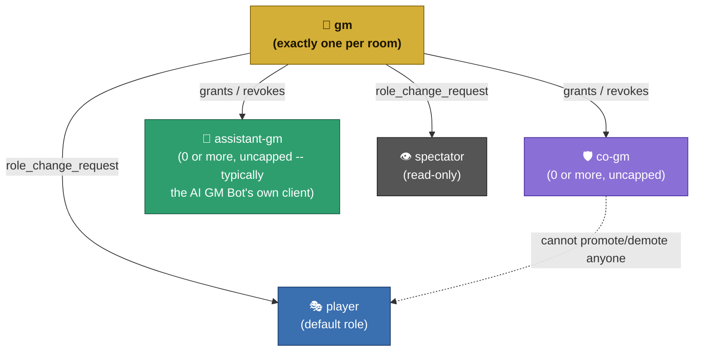
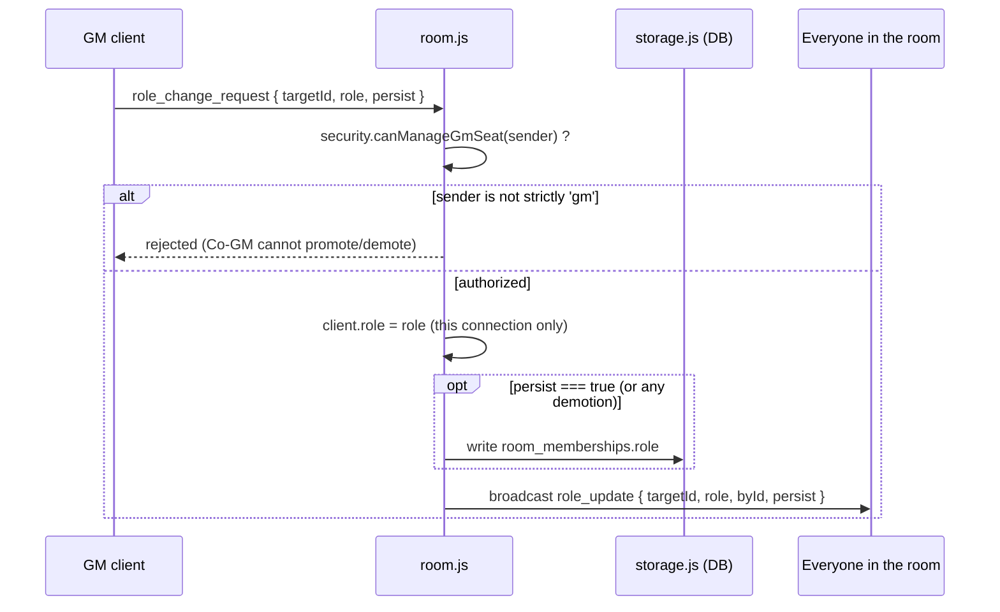
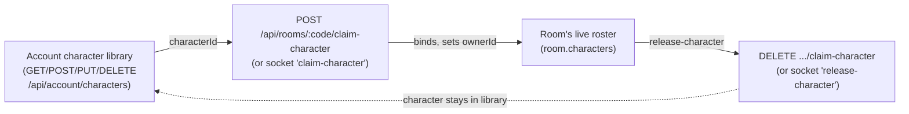

# Roles & Permissions

> Implemented in `server/room.js` (`handleGmRequest`/`handleGmApproval`/`handleRoleChangeRequest`) and `server/security.js` (`isGmLike`/`canManageGmSeat`/`isSpectator`). Promoted out of `DESIGN.md` into its own document since this is the most load-bearing part of the server's design and was previously buried at the bottom of a much longer file.

---

## 1. The five roles

Every connected client has exactly one role at a time, held on `client.role` (in-memory, per connection) and mirrored to `room_memberships.role` (persistent, per account) once the client is authenticated.

Only the GM seat itself is capped at exactly one; the diagram's downward arrows are permission *grants*, not a strict reporting hierarchy — a Co-GM's permissions are a subset of the GM's, not a link in an approval chain. `assistant-gm` (v4.12) is a sibling of Co-GM in the granting mechanism (same GM-only `role_change_request` flow, same session-vs-persisted choice) but carries **none** of Co-GM's elevated permissions — see the matrix below. It exists purely as a recognizable seat the AI GM Bot's own client can hold; see `fates-edge-ai-gm-bot`'s README "Assistant GM Mode" for what the bot does once it's assigned.

## 2. Permission matrix

| Action | GM | Co-GM | Assistant GM | Player | Spectator |
|---|:---:|:---:|:---:|:---:|:---:|
| Deck control (draw/shuffle/history) | ✅ | ✅ | ❌ | ❌ | ❌ |
| Edit any character | ✅ | ✅ | ❌ | Own claimed character only | ❌ |
| Kick / ban / unban a client | ✅ | ✅ | ❌ | ❌ | ❌ |
| Set/clear room password | ✅ | ✅ | ❌ | ❌ | ❌ |
| GM-only / secret adventure state | ✅ | ✅ | ❌ | ❌ | ❌ |
| Promote/demote a Co-GM or Assistant GM | ✅ | ❌ | ❌ | ❌ | ❌ |
| Transfer/revoke the GM seat | ✅ | ❌ | ❌ | ❌ | ❌ |
| Delete / reset the room | ✅ | ❌ | ❌ | ❌ | ❌ |
| View public room/adventure state | ✅ | ✅ | ✅ | ✅ | ✅ |
| Claim / release a character | n/a (doesn't need one) | n/a | n/a | ✅ | ❌ |

The three seat-management rows (promote/demote Co-GM/Assistant GM, transfer GM, delete/reset room) are gated by a strict `role === 'gm'` check (`security.canManageGmSeat()`) — everything else a GM can do, a Co-GM can also do, via `security.isGmLike(role)`. `assistant-gm` is deliberately **not** in `isGmLike()`'s set — server-side it's permission-equivalent to `player`, full stop. Whatever it means for a client holding this role to act as a GM's assistant is entirely up to that client's own logic (in practice, the AI GM Bot).

## 3. How a role actually changes

Notes:
- `persist: false` (the default) only flips the live connection's role — it reverts to whatever's on file the next time that user joins. Good for "run tonight's fight scene" without a permanent grant.
- `persist: true` writes through to `room_memberships.role`, so the grant survives reconnects.
- **Demotions always persist**, regardless of how the promotion was made — a saved Co-GM can be fully revoked, not just silenced for one session.
- A client's self-declared role on join is only trusted for `gm`/`player`/`spectator` — **neither `co-gm` nor `assistant-gm` is ever accepted from the client itself.** Each is only restored automatically when the account's persisted `room_memberships.role` already says the same value (i.e. a previously *saved* grant), so nobody can claim Co-GM or Assistant GM by simply asking for it at join time — including a client just claiming to be the AI GM Bot.
- **Role can only ever change through the flow diagrammed above (or its REST equivalent).** The plain-WebSocket transport's `presence` handler (`server/ws-handlers.js`) used to also accept a `role` field on any presence update and write it straight to `client.role` with no check at all — a connected client could send `{ type: 'presence', role: 'gm' }` and grant itself the GM seat, completely bypassing `canManageGmSeat()`/the one-GM-per-room rule. Fixed in [4.24.1]: presence updates can change a client's display `name`/`activeView` but never its `role` on either transport.

**v4.12: a REST equivalent exists too.** `POST /api/rooms/:code/clients/:clientId/role { role, persist? }` (API-key admin, see `server/api.js`) calls `room.setClientRole()` — the same mutate/persist/broadcast core as the diagram above (`_applyRoleChange()` in `room.js`), just entered from a route instead of a live GM connection. It exists because the socket path requires the *caller* to already be connected to the room holding the GM seat, which every REST-only integration (the Discord bot's admin commands are otherwise entirely `apiRequest()`-based) can't do. There is deliberately **no `canManageGmSeat()` check** on this path — the API key itself is the authorization, exactly like the neighboring kick/ban routes never check a sender's role either. `byId` in the resulting `role_update` broadcast is the literal string `'api'` rather than a client id, so recipients can tell a change came from outside the room.

## 4. Character claim/release

Bridges a player's account-owned character *library* (`GET/POST/PUT/DELETE /api/account/characters`, capped at `storage.MAX_CHARACTERS_PER_USER`) to a room's live character roster (`room.characters`), via a `room_character_claims` table: one row per `(room_code, user_id)`, enforcing exactly one live claim per player per room.

- Claiming again replaces the previous claim (one live claim per player per room).
- On join/rejoin (either transport), a previously-saved claim auto-resolves against the room's live roster — a returning player doesn't have to re-pick their character every session.
- The claimed character's roster record gets an `ownerId` field. A Player may only write to a character where `room.characterClaims[userId] === normalizeCharKey(name)` (checked via `room.canEditCharacter()`); GM/Co-GM bypass this check entirely; a Spectator never passes it.

## 5. Where this is enforced in code

| Concern | File | Function(s) |
|---|---|---|
| Role storage & broadcast | `server/room.js` | `handleRoleChangeRequest` (socket), `setClientRole` (REST/API-key), `_applyRoleChange` (shared core), `_persistRole` |
| Role assignment via REST | `server/api.js` | `POST /api/rooms/:code/clients/:clientId/role` |
| Role assignment in web client | `fates-edge-web-client/js/features/vtt/vtt-core.js`, `js/core/websocket.js` | `renderLocalPresence()` (picker UI, GM-only), `changeRole()` (sends `role_change_request`) |
| GM seat request/approve | `server/room.js` | `handleGmRequest`, `handleGmApproval` |
| Permission checks | `server/security.js` | `isGmLike`, `canManageGmSeat`, `isSpectator` |
| **Not** a role-change path (display metadata only) | `server/ws-handlers.js` | `presence` case / `sendEvent`-relayed `type: 'presence'` branch |
| Character edit authorization | `server/room.js` | `canEditCharacter` |
| Character claim/release (API) | `server/api.js` | `claim-character` routes |
| Character claim/release (sockets) | `server/socketio-handlers.js`, `server/ws-handlers.js` | `claim-character` / `release-character` handlers |
| Persistent role/claim storage | `server/storage.js` | `setMemberRole`, `setCharacterClaim`, `deleteCharacterClaim` |
